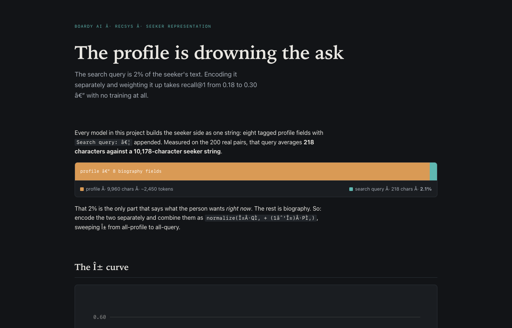
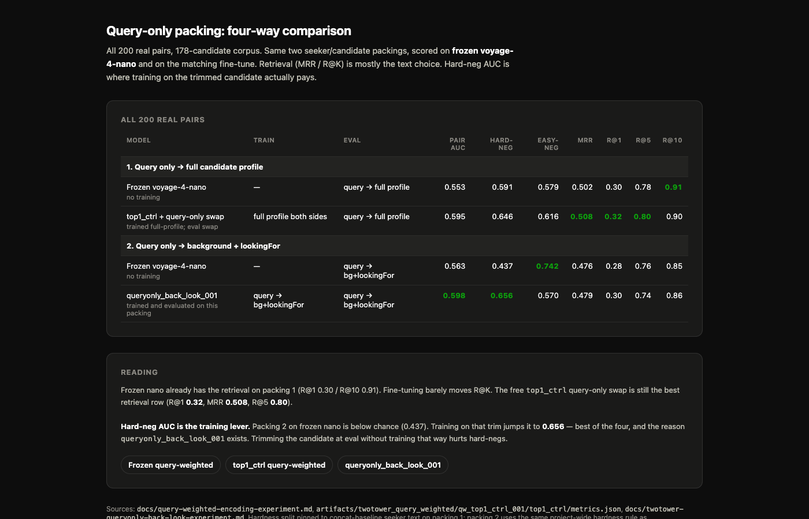
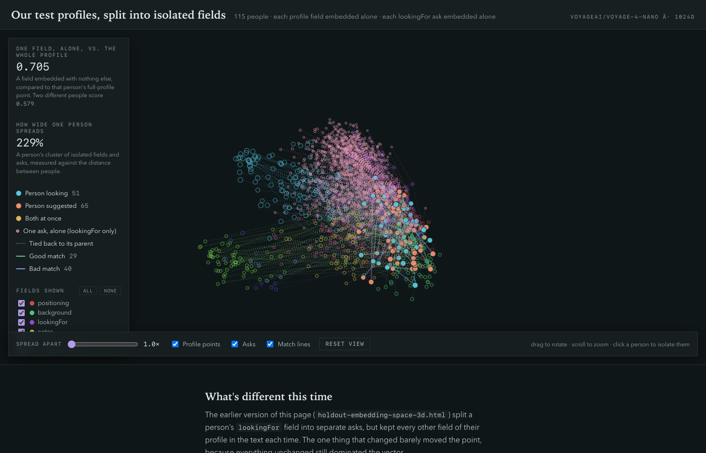
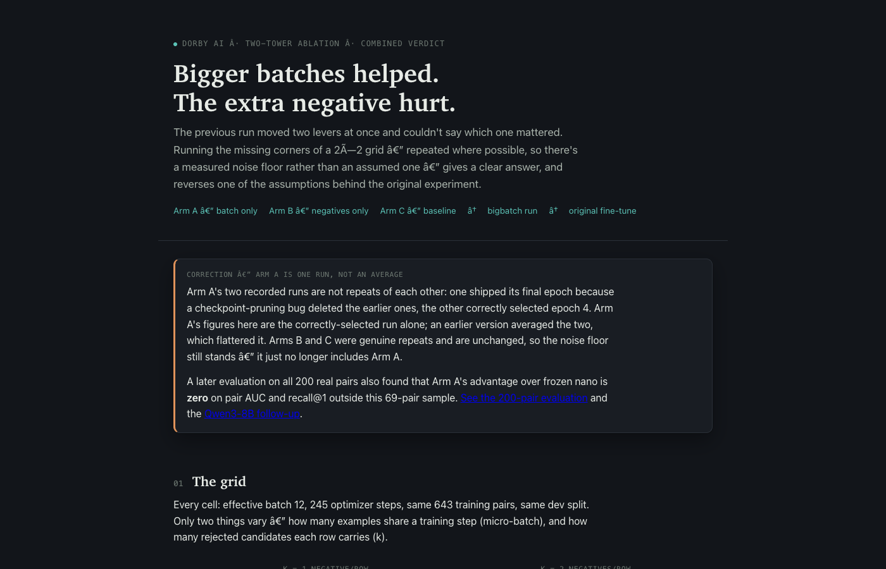
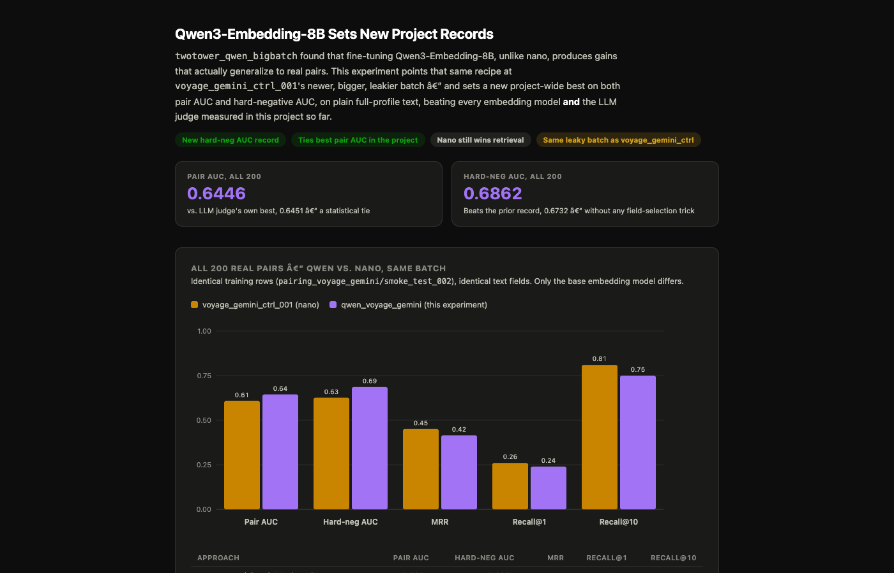
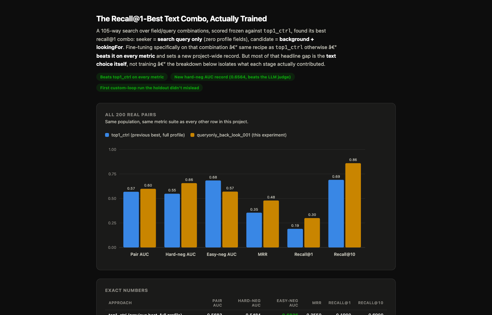
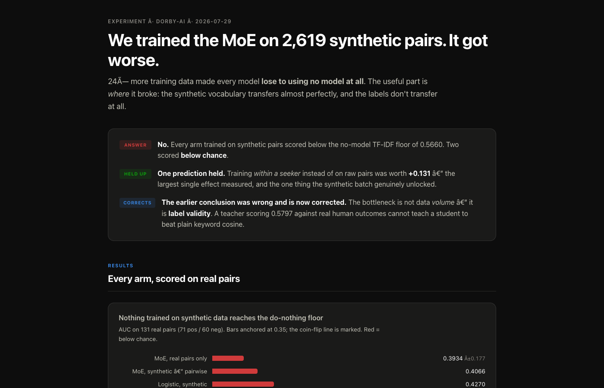
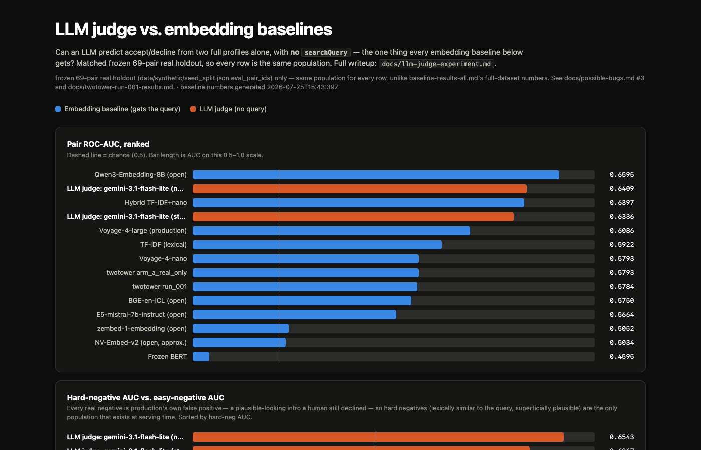
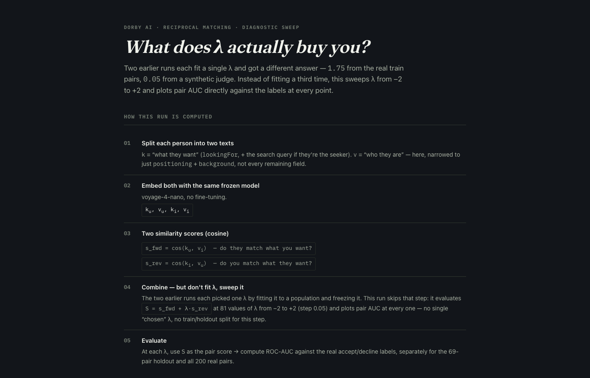
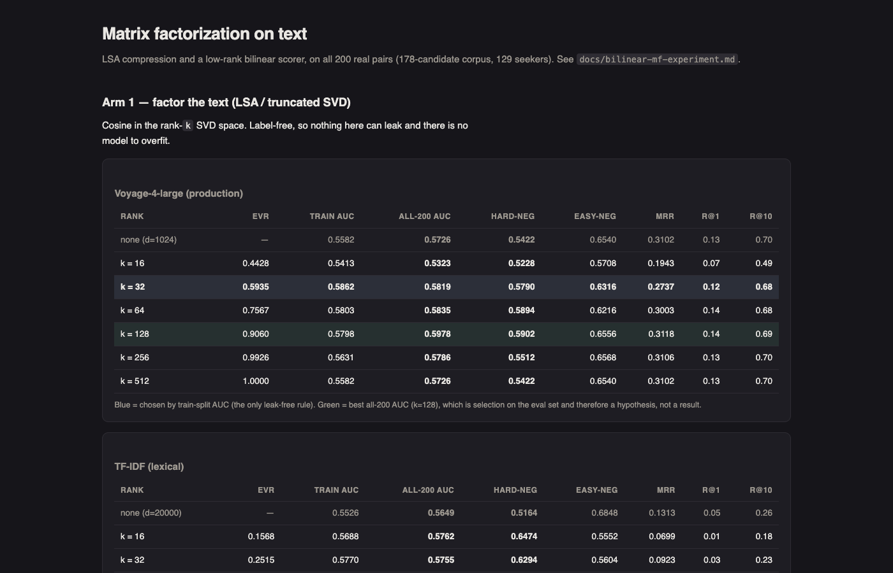

# Predicting Introduction Acceptance in a Professional Networking System

![[image-31-1.jpeg]]

**CSCI 6517: Recommender Systems**

**Project Report**

**Banner ID:** B01051076
**Name:** Harsh Pandey
**Date:** 14-Aug-2026
**Github Repo:** [Link](https://github.com/harsh20k/dorby-ai)

**Boardy AI × RecSys Course Project**
Ga Wu (Professor)


<div class="page-break" style="page-break-before: always;"></div>

Table of contents

```table-of-contents
title: 
style: nestedList # TOC style (nestedList|nestedOrderedList|inlineFirstLevel)
minLevel: 0 # Include headings from the specified level
maxLevel: 4 # Include headings up to the specified level
include: 
exclude: 
includeLinks: true # Make headings clickable
hideWhenEmpty: false # Hide TOC if no headings are found
debugInConsole: false # Print debug info in Obsidian console
```

<div class="page-break" style="page-break-before: always;"></div>

---

## Abstract

Boardy AI recommends professional introductions. This project asks: given that two people were already matched by the live system, can we predict whether they will actually accept? All 200 pairs passed production's own relevance filter — the label is the real human outcome, not topical relevance. Across 40+ experiments, encoding the search query separately from the profile nearly doubled top-1 retrieval (R@1 0.18→0.30, zero training). Fine-tuning on clean generated data reached 0.6446 pair AUC and 0.6862 hard-negative AUC. An LLM judge reached 0.6451 AUC — the only approach that does better on topically-similar declined pairs than obvious mismatches.

---

## 1. Introduction

Boardy matches professionals for introductions. Each seeker has a profile with a `lookingFor` section (a multi-goal wish list) and a `searchQuery` (what they want right now). The live system uses Voyage-4-large embeddings to surface candidates. This project asks: among pairs the system already surfaced as relevant, which introductions will humans accept?

**The label is not topical relevance.** Every pair passed production's relevance filter. Declined pairs are production's false positives — plausible introductions humans still turned down. Expect moderate scores across all methods; we are predicting subtle fit (stage, two-way interest, seniority) not topic match.

**Hard latency constraint: <100 ms.** This rules out per-candidate LLM calls and cross-encoders. Only bi-encoders fit — candidates are embedded offline, the online path is one query encode plus nearest-neighbor lookup. Every training experiment uses this shape.

**Contributions:** (1) Separate query/profile encoding nearly doubles retrieval with no training. (2) Three leakage probes distinguish helpful from harmful generated data. (3) Reciprocal scoring — does the candidate also want the seeker? — adds consistent signal. (4) Scoring each `lookingFor` paragraph separately outperforms treating the wish list as one text. (5) Eight architectural additions failed; text choice beat all of them.

---

## 2. Task, Data, and Metrics


### Data

200 real introductions: 100 accepted, 100 declined. Each pair has a seeker (profile + `searchQuery`) and a candidate (profile only). Split user-disjointly: **131 train / 69 held-out** — fixed in `data/synthetic/seed_split.json`. Boardy also shared a ~46,000-row production export (B-data) without clean accept/decline labels.

All main results use **all 200 pairs**: 100 positive queries ranked against 178 unique candidates (`eval_real_full/`).

### Metrics


**Pair AUC:** ROC-AUC for ranking accepted above declined. We slice by **hard negatives** (high token overlap with the seeker — the kind that exist in production) and **easy negatives** (low overlap — already filtered by production). Every strong embedding model drops on hard negatives; the LLM judge inverts this.

**Retrieval:** MRR, R@1, R@10 — does the accepted candidate rank near the top of 178 candidates?

---

## 3. The Starting Point

Before any training, 14 models were scored on all 200 pairs. Bar to beat: Voyage-4-large (0.5726), the encoder Boardy's live system uses.


| Model | Pair AUC | Hard-neg AUC | MRR | R@1 | R@10 |
|---|---:|---:|---:|---:|---:|
| **Voyage-4-large (production)** | **0.5726** | 0.5422 | 0.310 | 0.13 | **0.70** |
| Voyage-4-nano (frozen) | 0.5593 | 0.5046 | 0.317 | 0.18 | 0.59 |
| TF-IDF | 0.5649 | 0.5164 | 0.131 | 0.05 | 0.26 |
| BGE-en-ICL | 0.5389 | 0.5226 | **0.319** | **0.17** | 0.62 |
| Qwen3-Embedding-8B (frozen) | 0.5529 | 0.4680 | 0.205 | 0.05 | 0.55 |
| Frozen BERT | 0.4697 | 0.4108 | 0.094 | 0.02 | 0.18 |

*Source: [`docs/baseline-results-real200.md`](baseline-results-real200.md). Full 14-model table in Appendix A.*

Voyage-4-large leads pair AUC and R@10. TF-IDF's 0.5649 pair AUC is high but almost entirely from easy negatives (hard-neg AUC 0.5164, near chance). No open-weight model consistently beats production.

---

## 4. Result 1 — Choosing What Text to Encode

**Does how we arrange the profile text, separate from the model, matter?**

The `searchQuery` is ~2% of the seeker's concatenated text. Encoding the profile and query as two separate vectors, then blending — `normalize(α × query_vector + (1−α) × profile_vector)` — requires no training:



*Figure 4: α sweep on frozen Voyage-4-nano. The interior optimum (α=0.6) is missed when calibrating on synthetic pairs, which peak at α=1.*

| Approach | Pair AUC | Hard-neg AUC | MRR | R@1 | R@10 |
|---|---:|---:|---:|---:|---:|
| Concatenate (baseline) | 0.5593 | 0.5046 | 0.317 | 0.18 | 0.59 |
| Query only (α=1) | 0.5530 | **0.5914** | 0.502 | **0.30** | **0.91** |
| Blend α=0.6 | **0.5872** | 0.5818 | 0.465 | 0.25 | 0.89 |

Query-only doubles retrieval (R@1 0.18→0.30, R@10 0.59→0.91) with no training. The blend at α=0.6 gives the best pair AUC. The pattern replicates on every fine-tuned adapter tested. It also reduces live encoding work substantially (~2,500 tokens → ~55 tokens for the seeker). Source: [`docs/query-weighted-encoding-experiment.md`](query-weighted-encoding-experiment.md).

A 105-field-combination sweep confirmed the best packing: query-only on the seeker side, background+lookingFor on the candidate side.



*Figure 5: Query-only packing comparison. Query-only dominates retrieval; full-profile wins pair AUC but loses badly on R@1.*

**Which fields carry person-specific information?** Embedding each field in isolation:



*Figure 6: Field isolation in embedding space. Bottom three fields (scheduling/preferences) are more similar to other people's same field than to the person's own profile — boilerplate, not identity.*

`positioning`, `background`, `lookingFor` are person-specific. `locationAvailability`, `meetingAndSchedulingPreferences`, `personalPreferences` are boilerplate — removing them removes noise. Source: [`docs/holdout-field-isolation-embedding-space-3d.html`](html/holdout-field-isolation-embedding-space-3d.html).

---

## 5. Result 2 — Fine-Tuning a Shared Encoder

**Does LoRA fine-tuning on generated data improve on the frozen model?**

A small LoRA adapter (< 1% of parameters) is added to a frozen encoder and trained with MultipleNegativesRankingLoss. The adapter merges into the base weights at serving time — no extra serving overhead. Two base models tested: Voyage-4-nano (serving-feasible) and Qwen3-Embedding-8B (larger, higher accuracy).



*Figure 7: Ablation — micro-batch size of 6 beats 2 by 5 R@1 points. The benefit comes from more candidates per forward pass, not larger effective batch size via accumulation.*

| Model | Pair AUC | Hard-neg AUC | MRR | R@1 | R@10 |
|---|---:|---:|---:|---:|---:|
| Qwen fine-tune (voyage-gemini batch)† | **0.6446** | **0.6862** | 0.415 | 0.24 | — |
| Nano fine-tune (query→bg+lookingFor) | 0.5983 | 0.6564 | 0.479 | 0.30 | 0.86 |
| Voyage-4-nano (frozen, query-only) | 0.5530 | 0.5914 | **0.502** | **0.30** | **0.91** |
| Voyage-4-large (production) | 0.5726 | 0.5422 | 0.310 | 0.13 | 0.70 |

*† Qwen fine-tune carries a leakage caveat (candidate-only AUC 0.758; see Limitations).*



*Figure 8: Record fine-tune. The Qwen adapter beats every frozen model on both accept/decline separation and hard-negative discrimination.*

The best serving-feasible fine-tune (nano, query→bg+lookingFor) is the first model where hard-negative AUC (0.6564) exceeds easy-negative AUC (0.570) — previously seen only in the LLM judge.



*Figure 9: Best serving-feasible fine-tune. Hard-neg AUC flips above easy-neg AUC — a sign the model handles the production-relevant population.*

**Key finding:** swapping query/profile text at *test time* moves results more than what text was used during training. The adapter teaches better encoding, but the representation choice at inference still dominates. Source: [`docs/twotower-no-query-experiment.md`](twotower-no-query-experiment.md).

---

## 6. Result 3 — Generating Training Data That Helps

**Can generated pairs provide real training signal without hiding the label in the text?**


The first 460-pair batch failed. A word-frequency classifier on the candidate's text *alone* (no seeker, no query) predicted the label at 99.2% accuracy — the generator wrote the label into the text. The fine-tune trained on it scored 0.4845 hard-negative AUC, **below chance**. The batch was quarantined; a real-only baseline on 111 pairs beat it on every metric. Source: [`docs/possible-bugs.md`](possible-bugs.md) (#4).

**Three probes now gate every batch:**

1. **Candidate-only AUC:** word-frequency on candidate text predicts label? Real floor: ~0.49. Threshold: > 0.55 signals leakage.
2. **Lexical circularity:** word-overlap between query and candidate predicts label? If yes, model learns overlap not fit.
3. **Seeker-identity AUC:** knowing only the seeker (no text) predicts label? If yes, per-seeker base rates dominate.

The clean pipeline: Qwen3-Embedding-8B dense + BM25 keyword retrieval, fused by weighted RRF → Gemini judge labels top retrieved pairs. This separates retrieval from labeling — neither grades its own output.

| Batch | Candidate-only AUC | Lexical circularity | Seeker-identity AUC |
|---|---:|---:|---:|
| First batch (quarantined) | **0.992** | — | — |
| rrf_002 | 0.634 | 0.701 | 0.687 |
| rrf_003 (main training batch) | — | — | ~0.687 |
| voyage-gemini batch | 0.758 | 0.481 | 0.780 |



*Figure 11: What transfers and what doesn't. Word distributions transfer; the label relationship does not.*

Vocabulary transfers; labels do not. A model trained to predict generated labels scores 0.427 AUC on real outcomes — below chance. The LLM judge scoring ~0.59 on hard pairs is the ceiling for anything trained on its labels. Source: [`docs/moe-rrf003-synthetic-training-findings.md`](moe-rrf003-synthetic-training-findings.md). **ELABORATION NEEDED**

---

## 7. Result 4 — Asking an LLM Directly

**Can an LLM predict accept/decline from profiles alone, without retrieval?**

Feed both profiles to Gemini flash-lite; ask whether the introduction is a good match. The `searchQuery` is withheld from naive and calibrated variants to test profile-only signal.



*Figure 12: Hard/easy split across approaches. The judge is the only model that improves on hard negatives relative to easy ones.*

| Prompt variant | Pair AUC | Hard-neg AUC | Easy-neg AUC | Population |
|---|---:|---:|---:|---|
| Focused (trimmed fields + query) | **0.6451** | 0.6590 | 0.6570 | all-200 |
| Naive (complete profiles, no query) | 0.6177 | — | — | all-200 |
| Forced step-by-step scoring | 0.6100 | 0.6225 | 0.6394 | all-200 |
| "Calibrated" (told base rate) | 0.5901 | 0.5879 | 0.5310 | held-out |

The focused prompt is the best single result in this project (0.6451 AUC, 0.6590 hard-neg AUC). It is the only approach where hard-negative AUC exceeds easy-negative AUC — evidence it reasons about structural fit rather than word overlap. Adding information (base rate, production pre-vetting) hurt; forced step-by-step scoring hurt. **Not deployable** under the 100 ms latency constraint, but useful as an accuracy reference and training-data labeler. Source: [`docs/llm-judge-experiment.md`](llm-judge-experiment.md).

---

## 8. Result 5 — Scoring Fit in Both Directions

**Does adding a term for whether the candidate would also want the seeker help?**

Split each profile into "asking" (lookingFor + searchQuery for seeker) and "background" (positioning + background). Score:

```
combined = sim(seeker asking, candidate background) + λ × sim(candidate asking, seeker background)
```

Sweep λ on the training split; retrieval uses the forward term only.



*Figure 13: λ sweep — reciprocal weight vs pair AUC across encoders. The direction is consistent across all models tested.*

| Encoder | Forward-only AUC | Combined AUC (best λ) | Held-out combined |
|---|---:|---:|---:|
| Frozen Voyage-4-nano | 0.5638 | 0.5964 (λ=1.75) | 0.6241 |
| top1_ctrl fine-tune | 0.5890 | 0.5961 (λ=0.50) | 0.6853 |
| voyage_gemini_ctrl fine-tune | 0.6081 | **0.6587** (λ=1.90) | **0.7345** |

Positive λ always helps; negative λ always hurts. On the frozen model the 95% bootstrap CI includes zero — the direction is consistent but not confirmed at this sample size. The highest held-out result (0.7345) is from the leakier voyage-gemini batch. Source: [`docs/reciprocal-static-experiment.md`](reciprocal-static-experiment.md), [`docs/reciprocal-lambda-grid-voyage-gemini-ctrl-experiment.md`](reciprocal-lambda-grid-voyage-gemini-ctrl-experiment.md).

---

## 9. Result 6 — Score Each Ask Separately

**Does treating each paragraph of the wish list as a separate prediction help?**

Each pair becomes multiple rows (one per `lookingFor` paragraph, 5.4 on average). A mixture-of-experts model (4 experts, TF-IDF embeddings, 47→24→16 units each) scores each row separately and pools. Evaluated by 5×5-fold cross-validation on 131 real train pairs.


| Approach | Mean AUC | vs logistic regression |
|---|---:|---|
| Plain logistic regression | 0.5758 | — |
| Score each ask, attention pooling | **0.6467** | +0.071, wins 5/5 seeds |
| Score each ask, simple average | 0.6404 | +0.065, wins 5/5 seeds |
| Single network (no mixture) | 0.5446 | −0.031 |

The gain (+0.071 AUC, consistent across 5/5 seeds) is the most replicated improvement on real training pairs in this project. Pooling method does not matter (attention ≈ average); the mixture of experts does matter (+0.10 vs a single network). Source: [`docs/moe-sectioned-experiment.md`](moe-sectioned-experiment.md).

---

## 10. What Did Not Work

Most architectural additions failed to beat a simpler text-choice change.



*Figure 15: Selection overfitting: 64 configurations on 131 pairs inflates cross-validated AUC by 0.12 above the honest result.*

| Addition | Result | Simpler alternative that won |
|---|---|---|
| Two separate encoders | Hard-neg AUC 0.483, below chance | One shared encoder |
| Learned field selector | Worst retrieval (R@1 0.23) | Fixed blend α=0.6 |
| Drift penalty (KL regularization) | Slightly worse in two separate tests | Plain training |
| Sharper training objective | R@1 0.18→0.14, below frozen baseline | Default settings |
| Bilinear score correction | Inner CV 0.74, honest 0.62 | Cosine + LSA text compression |
| Forced step-by-step LLM reasoning | AUC 0.6409→0.6336, yes-rate 55%→75% | Naive direct prompt |
| Automatic prompt rewrites (10 runs) | All 10 below the original prompt | Original unmodified prompt |

Sources: [`docs/twotower-split-experiment.md`](twotower-split-experiment.md), [`docs/twotower-field-gate-experiment.md`](twotower-field-gate-experiment.md), [`docs/twotower-kl-reg-experiment.md`](twotower-kl-reg-experiment.md), [`docs/twotower-top1-optimised-experiment.md`](twotower-top1-optimised-experiment.md), [`docs/bilinear-mf-experiment.md`](bilinear-mf-experiment.md), [`docs/llm-judge-experiment.md`](llm-judge-experiment.md), [`docs/judge-prompt-evolution-experiment.md`](judge-prompt-evolution-experiment.md).

---

## 11. Serving

The bi-encoder shape is the only architecture that fits the <100 ms latency constraint. Candidates are embedded offline; the online path is one query encode plus nearest-neighbor lookup, flat as the pool grows. A merged LoRA adapter adds no serving overhead over the frozen base.

No latency benchmark exists in this project — all numbers are offline accuracy. Whether a frozen nano query encode + nearest-neighbor lookup completes in under 100 ms on Boardy's hardware has not been measured; that is a prerequisite before calling any configuration a deployment win. Source: [`docs/objective.md`](objective.md).

---

## 12. Limitations

- **Small held-out set unreliable for strong models.** Among the top 6 models, held-out and all-200 rankings are uncorrelated. Several early claims reversed on re-measurement (Qwen3-8B: retracted result 0.6595 reversed to 0.5529 on all-200). Use all-200 numbers for decisions.
- **131 training pairs manufactures results under selection.** The bilinear experiment: 0.74 cross-validated AUC, 0.62 honest — a 0.12 gap from 64 configurations. Always use multi-seed cross-validation and report confidence intervals.
- **Retrieval metrics are partly self-graded.** Production selected candidates with the same `searchQuery` used for evaluation. A model scoring by query similarity partially replicates that selection. Pair AUC does not have this circularity.
- **Generated labels are capped by the judge.** The best LLM judge scores ~0.59–0.64 on hard pairs; models trained on its labels cannot exceed that ceiling. The Qwen fine-tune (0.6446) approaches this limit, but it was trained on the leakier voyage-gemini batch — a data-artifact contribution cannot be ruled out.
- **B-data does not validate the accept/decline models.** All models score near or below chance on the ~46,000-row production export. Different label definition, a 21,000-candidate pool, and ~86% accepted skew make the two datasets incomparable.


---

## 13. Conclusion

The project's central finding: **what text you encode matters more than which model you use.** Query-only encoding on the seeker side nearly doubled top-1 retrieval (R@1 0.18→0.30) with no training. The best serving-feasible fine-tune used query-only on the seeker side and background+lookingFor on the candidate side. These text choices beat every architectural addition tested.

Retrieval and outcome prediction are different problems. Query signals drive retrieval; structural fit (stage, two-way interest, seniority match) drives accept/decline. Improvements to one do not reliably carry to the other.

The recommended design: (1) query-weighted bi-encoder retrieval — already the best retrieval in this project (R@1 0.30, R@10 0.91, frozen model, no training); then (2) a fast re-ranker over the top-N candidates that scores fit in both directions. The bottleneck for step 2 is label quality — the LLM judge's ~0.59 hard-pair ceiling limits anything trained on its verdicts. More real accept/decline outcomes would unblock further progress more directly than new model architectures.

**Open questions:** Does the reciprocal gain hold on a clean batch? Can a lightweight re-ranker distill the LLM judge's non-lexical reasoning within the latency constraint? Does the sectioned MoE result replicate on the held-out set? What is the actual serving latency on Boardy's hardware?

---

## Appendix A — Full Results Table

All models on all 200 real pairs, ranked by pair AUC. LLM judges are classification-only (no retrieval metrics).

**ELABORATION NEEDED** — this table will be updated as experiments complete.

| Model | Type | Pair AUC | Hard-neg AUC | Easy-neg AUC | MRR | R@1 | R@10 | Source |
|---|---|---:|---:|---:|---:|---:|---:|---|
| LLM judge, focused prompt | LLM (no retrieval) | **0.6451** | 0.6590 | 0.6570 | — | — | — | [`llm-judge-experiment.md`](llm-judge-experiment.md) |
| LLM judge, naive prompt | LLM (no retrieval) | 0.6177 | — | — | — | — | — | [`llm-judge-experiment.md`](llm-judge-experiment.md) |
| Qwen fine-tune, voyage-gemini batch | Fine-tuned | **0.6446** | **0.6862** | — | 0.415 | 0.24 | — | [`twotower-qwen-voyage-gemini-experiment.md`](twotower-qwen-voyage-gemini-experiment.md) |
| voyage_gemini_ctrl fine-tune + reciprocal (best λ) | Fine-tuned + reciprocal | 0.6587 | — | — | — | — | — | [`reciprocal-lambda-grid-voyage-gemini-ctrl-experiment.md`](reciprocal-lambda-grid-voyage-gemini-ctrl-experiment.md) |
| voyage_gemini_ctrl fine-tune (forward only) | Fine-tuned | 0.6081 | 0.6264 | — | 0.451 | 0.26 | — | [`twotower-voyage-gemini-ctrl-experiment.md`](twotower-voyage-gemini-ctrl-experiment.md) |
| Nano fine-tune, query→bg+lookingFor | Fine-tuned | 0.5983 | **0.6564** | 0.5700 | 0.479 | 0.30 | 0.86 | [`twotower-queryonly-back-look-experiment.md`](twotower-queryonly-back-look-experiment.md) |
| Frozen nano, query-only | Frozen + text choice | 0.5530 | 0.5914 | — | **0.502** | **0.30** | **0.91** | [`query-weighted-encoding-experiment.md`](query-weighted-encoding-experiment.md) |
| Frozen nano, blend α=0.6 | Frozen + text choice | 0.5872 | 0.5818 | — | 0.465 | 0.25 | 0.89 | [`query-weighted-encoding-experiment.md`](query-weighted-encoding-experiment.md) |
| Frozen nano + reciprocal (λ=1.75) | Frozen + reciprocal | 0.5964 | — | — | — | — | — | [`reciprocal-static-experiment.md`](reciprocal-static-experiment.md) |
| Nano top1_ctrl fine-tune (full text) | Fine-tuned | 0.5683 | 0.5484 | 0.6836 | 0.355 | 0.19 | 0.69 | [`twotower-top1-optimised-experiment.md`](twotower-top1-optimised-experiment.md) |
| Qwen micro-6 fine-tune (rrf_003) | Fine-tuned | 0.5947 | 0.5608 | 0.6708 | 0.303 | 0.14 | 0.66 | [`twotower-qwen-bigbatch-experiment.md`](twotower-qwen-bigbatch-experiment.md) |
| Nano Arm A (real-only) | Fine-tuned | 0.5594 | 0.5558 | 0.6416 | 0.334 | 0.18 | 0.64 | [`twotower-run-001-findings.md`](twotower-run-001-findings.md) |
| **Voyage-4-large (production)** | **Frozen baseline** | **0.5726** | 0.5422 | 0.6540 | 0.310 | 0.13 | 0.70 | [`baseline-results-real200.md`](baseline-results-real200.md) |
| Voyage-4-nano (frozen, full text) | Frozen baseline | 0.5593 | 0.5046 | 0.6960 | 0.317 | 0.18 | 0.59 | [`baseline-results-real200.md`](baseline-results-real200.md) |
| TF-IDF (word overlap) | Lexical baseline | 0.5649 | 0.5164 | 0.6848 | 0.131 | 0.05 | 0.26 | [`baseline-results-real200.md`](baseline-results-real200.md) |
| BGE-en-ICL | Open-weight frozen | 0.5389 | 0.5226 | 0.5928 | 0.319 | 0.17 | 0.62 | [`baseline-results-real200.md`](baseline-results-real200.md) |
| Qwen3-Embedding-8B (frozen) | Open-weight frozen | 0.5529 | 0.4680 | 0.7208 | 0.205 | 0.05 | 0.55 | [`all-200-baseline-sweep.md`](all-200-baseline-sweep.md) |
| E5-Mistral-7B-instruct | Open-weight frozen | 0.4597 | 0.3772 | 0.6144 | 0.116 | 0.03 | 0.30 | [`baseline-results-real200.md`](baseline-results-real200.md) |
| Frozen BERT | Frozen baseline | 0.4697 | 0.4108 | 0.6508 | 0.094 | 0.02 | 0.18 | [`baseline-results-real200.md`](baseline-results-real200.md) |
| NV-Embed-v2 (approx.) | Open-weight frozen | 0.4841 | 0.3836 | 0.6608 | 0.086 | 0.04 | 0.16 | [`baseline-results-real200.md`](baseline-results-real200.md) |
| zembed-1-embedding | Open-weight frozen | 0.4707 | 0.4864 | 0.4816 | 0.038 | 0.01 | 0.08 | [`baseline-results-real200.md`](baseline-results-real200.md) |

*Rows marked with — were not scored on that metric. The Qwen fine-tune on the voyage-gemini batch carries a leakage caveat (Section 12). The voyage_gemini_ctrl reciprocal all-200 AUC (0.6587) is the rightmost λ=1.90 value on a flat shelf, not a sharp interior optimum.*

---

## Appendix B — Experiment Ledger

Every experiment run in this project, grouped by track. One row per experiment. **ELABORATION NEEDED** — add run configuration details, training sample sizes, and hardware to each row.

### Track 1: Frozen baselines

| Experiment | What changed | All-200 pair AUC | Verdict | Write-up |
|---|---|---:|---|---|
| Frozen BERT | 512-token BERT-base-uncased | 0.4697 | Floor | [`baseline-metrics.md`](baseline-metrics.md) |
| Voyage-4-nano | Voyage-4-nano, full text | 0.5593 | Baseline | [`baseline-results-real200.md`](baseline-results-real200.md) |
| Voyage-4-large | Boardy production model | 0.5726 | **Production bar** | [`baseline-results-real200.md`](baseline-results-real200.md) |
| TF-IDF | Word-frequency cosine | 0.5649 | Strong on easy-neg, fails retrieval | [`baseline-results-real200.md`](baseline-results-real200.md) |
| BGE-en-ICL | BAAI open-weight, zero-shot | 0.5389 | Best frozen retrieval (MRR 0.319) | [`hf-embedding-baseline-findings.md`](hf-embedding-baseline-findings.md) |
| Qwen3-Embedding-8B (frozen) | 8B open-weight | 0.5529 (retracted 0.6595) | Below production on all-200 | [`all-200-baseline-sweep.md`](all-200-baseline-sweep.md) |
| E5-Mistral-7B-instruct | Instruct-tuned open-weight | 0.4597 | Fails | [`hf-embedding-baseline-findings.md`](hf-embedding-baseline-findings.md) |
| NV-Embed-v2 | NVidia open-weight (approx.) | 0.4841 | Fails; result is approximate | [`hf-embedding-baseline-findings.md`](hf-embedding-baseline-findings.md) |
| zembed-1-embedding | Purpose-built retrieval 4B | 0.4707 | Near-chance, worst retrieval | [`hf-embedding-baseline-findings.md`](hf-embedding-baseline-findings.md) |

### Track 2: Choosing what text to encode

| Experiment | What changed | Key metric | Verdict | Write-up |
|---|---|---|---|---|
| Query ablation (no-query variants) | Remove `searchQuery` from seeker | MRR −19–26% | Query is load-bearing for retrieval | [`baseline-results-real200.md`](baseline-results-real200.md) |
| Field isolation | Embed each field alone, measure identity signal | See Section 4 table | Bottom 3 fields are boilerplate | [`experiment-graphs-index.md`](experiment-graphs-index.md) |
| lookingFor sectioning | Split seeker wish list by paragraph | Pair AUC +0.016 | Seeker-side helps, candidate-side hurts | [`lookingfor-sectioning-findings.md`](lookingfor-sectioning-findings.md) |
| Query-weighted encoding (qw_001) | Separate query + profile vectors, blend α | R@1 0.18→0.30, R@10 0.59→0.91 | **Best retrieval, zero training** | [`query-weighted-encoding-experiment.md`](query-weighted-encoding-experiment.md) |
| Query-weighted on fine-tune (top1_ctrl) | Apply same blend to fine-tuned adapter | R@1 0.19→0.32 | Pattern replicates on fine-tune | [`query-weighted-twotower-experiment.md`](query-weighted-twotower-experiment.md) |
| Voyage-4-large query-only | Query-only on production model | R@1 0.42, MRR 0.590 | **Best retrieval in project (any model)** | [`twotower-no-query-experiment.md`](twotower-no-query-experiment.md) |
| Nomad drift (whole-profile) | Calibrate α on synthetic pairs | Calibration picks α=1.0, real-pair interior at α=0.6 | Boundary-monotonic calibration fails interior | [`nomad-drift-experiment.md`](nomad-drift-experiment.md) |
| Nomad drift (sectioned) | Calibrate section-selected blend | Section wins 4/5 metrics at interior | Section-selected blend is slightly better | [`nomad-drift-sectioned-experiment.md`](nomad-drift-sectioned-experiment.md) |

### Track 3: Fine-tuning

| Experiment | Base model / batch | All-200 pair AUC | Verdict | Write-up |
|---|---|---:|---|---|
| run_001 (ContrastiveLoss, unfixed synth) | Nano / 530-pair (leaky) | 0.578 | **Failed**: below-chance hard-neg | [`twotower-run-001-results.md`](twotower-run-001-results.md) |
| arm_a_real_only | Nano / 111 real pairs | 0.5594 | Marginal gain; proof synth was harmful | [`twotower-run-001-findings.md`](twotower-run-001-findings.md) |
| distill_judge_001 | Nano / 111 real pairs, soft labels | 0.604 | Soft labels help; checkpoint lost | [`experiment-graphs-index.md`](experiment-graphs-index.md) |
| rrf_triplet_voyage_nano_001 | Nano / rrf_003 triplets | — | First fine-tune to beat large on held-out | [`twotower-rrf-triplet-experiment.md`](twotower-rrf-triplet-experiment.md) |
| rrf_triplet_qwen3_8b | Qwen / rrf_003 triplets | — | Best held-out result at time | [`twotower-rrf-triplet-experiment.md`](twotower-rrf-triplet-experiment.md) |
| abl_a (micro-batch 6, k=1) | Nano / rrf_003 | 0.598 | Best ablation cell; batch size key lever | [`twotower-rrf-triplet-ablation-experiment.md`](twotower-rrf-triplet-ablation-experiment.md) |
| top1_ctrl | Nano / rrf_003, recall@1 checkpoint | 0.5683 | **Best nano (full text)** | [`twotower-top1-optimised-experiment.md`](twotower-top1-optimised-experiment.md) |
| top1_sharp | Nano / rrf_003, sharpened loss | 0.5429 | **Failed**: R@1 below frozen baseline | [`twotower-top1-optimised-experiment.md`](twotower-top1-optimised-experiment.md) |
| no_query_001 | Nano / rrf_003, profile-only seeker at train | 0.5574 | Wash; training text barely matters | [`twotower-no-query-experiment.md`](twotower-no-query-experiment.md) |
| query_only_001 | Nano / rrf_003, query-only seeker at train | 0.5952 | Wash vs eval-time swap | [`twotower-query-only-experiment.md`](twotower-query-only-experiment.md) |
| split_001 | Two separate nano adapters | 0.5677 / hard-neg 0.483 | **Failed**: below-chance hard-neg | [`twotower-split-experiment.md`](twotower-split-experiment.md) |
| field_gate_001 | Learned gate over 3 seeker fields | 0.5919 / worst retrieval | **Failed on retrieval** | [`twotower-field-gate-experiment.md`](twotower-field-gate-experiment.md) |
| kl_reg_ctrl_001 | top1_ctrl + drift penalty | 0.5504 | Slight loss | [`twotower-kl-reg-experiment.md`](twotower-kl-reg-experiment.md) |
| field_bg_look_001 | Two-field text (bg+lookingFor) | 0.5610 | Loses MRR/R@1, wins hard-neg only | [`twotower-field-pairs-experiment.md`](twotower-field-pairs-experiment.md) |
| queryonly_back_look_001 | Query seeker, bg+lookingFor candidate | 0.5983 / hard-neg 0.6564 | **Best nano fine-tune** | [`twotower-queryonly-back-look-experiment.md`](twotower-queryonly-back-look-experiment.md) |
| qwen_micro6 (rrf_003) | Qwen / rrf_003 | 0.5947 | Best rrf_003 pair AUC | [`twotower-qwen-bigbatch-experiment.md`](twotower-qwen-bigbatch-experiment.md) |
| voyage_gemini_ctrl_001 | Nano / voyage-gemini batch | 0.6081 | Beats top1_ctrl (leakier batch) | [`twotower-voyage-gemini-ctrl-experiment.md`](twotower-voyage-gemini-ctrl-experiment.md) |
| voyage_gemini_kl_001 | Nano + drift penalty / voyage-gemini | 0.5479 | **Failed**: KL loses again, wider | [`twotower-voyage-gemini-kl-experiment.md`](twotower-voyage-gemini-kl-experiment.md) |
| qwen_voyage_gemini_001 | Qwen / voyage-gemini batch | 0.6446 / hard-neg 0.6862 | **Project record (accept/decline AUC)** | [`twotower-qwen-voyage-gemini-experiment.md`](twotower-qwen-voyage-gemini-experiment.md) |
| ask_offer_001 | Two towers, Ask+Offer jointly | 0.5714 (combined) | Weak forward-only; reciprocal rescues | [`twotower-ask-offer-experiment.md`](twotower-ask-offer-experiment.md) |
| ask_offer_posbg_001 | Corrected field set for offer | 0.5754 (combined) | Wash vs wide-offer | [`twotower-ask-offer-posbg-experiment.md`](twotower-ask-offer-posbg-experiment.md) |

### Track 4: Generated training data

| Experiment | Scale | Probe results | Verdict | Write-up |
|---|---|---|---|---|
| batch_500_001 (labeled-pair LangGraph) | 460 pairs promoted | Candidate-only AUC 0.992 | **Quarantined**: actively harmful | [`possible-bugs.md`](possible-bugs.md) |
| pair_test_001 (profile-first + fusion labels) | 52 pos / 52 neg | Lexical circularity 0.868 | Labels are query overlap, not fit | [`profile-generation-local-and-bedrock.md`](profile-generation-local-and-bedrock.md) |
| rrf_002 | 275 pairs | Candidate-only 0.634, circ. 0.701 | Passes; seeker base-rate remains | [`rrf-pairing-pipeline.md`](rrf-pairing-pipeline.md) |
| rrf_003 | 2,619 pairs (1,056 triplets) | — | **Training batch for most fine-tunes** | [`rrf-pairing-pipeline.md`](rrf-pairing-pipeline.md) |
| rrf_qwen_full_001 | 25,445 pairs | Seeker-identity 0.739 | Large; train within-seeker only | [`experiment-graphs-index.md`](experiment-graphs-index.md) |
| voyage-gemini batch | ~19,700 pairs | Candidate-only 0.758, seeker-id 0.780 | Leakier; used for Qwen record fine-tune | [`twotower-voyage-gemini-ctrl-experiment.md`](twotower-voyage-gemini-ctrl-experiment.md) |

### Track 5: LLM judge

| Experiment | Variant | All-200 pair AUC | Verdict | Write-up |
|---|---|---:|---|---|
| gemini-3.1-flash-lite, naive | No query | 0.6177 | Best classification (no retrieval) | [`llm-judge-experiment.md`](llm-judge-experiment.md) |
| gemini-3.1-flash-lite, calibrated | Told base rate + production vetting | 0.5901 | Information hurt | [`llm-judge-experiment.md`](llm-judge-experiment.md) |
| gemini-3.1-flash-lite, structured CoT | Six scored aspects | 0.6100 | Regresses to middle | [`llm-judge-experiment.md`](llm-judge-experiment.md) |
| gemini-3.1-flash-lite, focused | Query + trimmed fields | **0.6451** | **Best pair AUC in project** | [`llm-judge-experiment.md`](llm-judge-experiment.md) |
| Gemma-3-27B (Bedrock), naive | No query | 0.5823 | Lower but hard-neg 0.622 | [`llm-judge-experiment.md`](llm-judge-experiment.md) |
| Qwen3-32B (Bedrock), naive | No query | 0.5802 | Lower but hard-neg 0.622 | [`llm-judge-experiment.md`](llm-judge-experiment.md) |
| Qwen3.5-4B (self-hosted), naive+query | With query | 0.5888 | Hard-neg 0.627 (all-200) | [`qwen35-judge-experiment.md`](qwen35-judge-experiment.md) |
| evo_001–evo_009 | Automatic prompt rewrite (9 runs) | 0.5700–0.6105 | **All below naive** | [`judge-prompt-evolution-experiment.md`](judge-prompt-evolution-experiment.md) |
| evo_focused_001 | Evolution on focused seed | 0.5885 vs 0.6474 seed | −0.059 from seed; confidence died | [`judge-prompt-evolution-focused-experiment.md`](judge-prompt-evolution-focused-experiment.md) |

### Track 6: Other model shapes

| Experiment | Approach | Result | Verdict | Write-up |
|---|---|---|---|---|
| MoE reranker (pair-level) | 3-expert MoE over scalars | CV 0.5536 vs 0.5282 no-model | Indistinguishable from chance | [`moe-reranker-experiment.md`](moe-reranker-experiment.md) |
| Sectioned MoE | Per-ask row, 4-expert, 5×5-fold CV | **0.6467 vs 0.5758** logistic | **Best on real train pairs** | [`moe-sectioned-experiment.md`](moe-sectioned-experiment.md) |
| Bilinear MF (LSA arm) | Truncated SVD text compression | Hard-neg AUC +0.037–0.100 | Durable hard-neg improvement | [`bilinear-mf-experiment.md`](bilinear-mf-experiment.md) |
| Bilinear MF (learned score) | Low-rank correction to cosine | Inner CV 0.74, honest 0.62 | Failed: selection overfitting | [`bilinear-mf-experiment.md`](bilinear-mf-experiment.md) |
| Knowledge graph (N=1) | Decompose profiles into typed graphs | Identifies wrong-side mismatch | Motivating diagnostic, not a model | [`knowledge-graph-experiment.md`](knowledge-graph-experiment.md) |
| Reciprocal static (frozen nano) | Forward + λ·reverse scoring | All-200 AUC 0.5964, CI crosses 0 | Directional; not statistically confirmed | [`reciprocal-static-experiment.md`](reciprocal-static-experiment.md) |
| Reciprocal grid (top1_ctrl fine-tune) | Same, on fine-tuned adapter | All-200 AUC 0.5961 | Consistent positive sign | [`reciprocal-lambda-grid-top1ctrl-experiment.md`](reciprocal-lambda-grid-top1ctrl-experiment.md) |
| Reciprocal grid (voyage_gemini_ctrl) | Same, on stronger fine-tune | All-200 0.6587, holdout 0.7345 | Strong but leaky batch caveat | [`reciprocal-lambda-grid-voyage-gemini-ctrl-experiment.md`](reciprocal-lambda-grid-voyage-gemini-ctrl-experiment.md) |

### Track 7: Scale check (B-data)

| Experiment | Model | Pair AUC | Verdict | Write-up |
|---|---|---:|---|---|
| B-data TF-IDF | Word-overlap cosine | 0.5121 | Near chance | [`bdata-tfidf-experiment.md`](bdata-tfidf-experiment.md) |
| B-data Voyage-4-nano | Full profile | 0.4691 | **Below chance** | [`bdata-voyage-nano-experiment.md`](bdata-voyage-nano-experiment.md) |
| B-data Voyage-4-nano (posbg) | Narrow field set | 0.5185 | Near chance; MRR 0.032 at 21k candidates | [`bdata-voyage-nano-posbg-experiment.md`](bdata-voyage-nano-posbg-experiment.md) |
| Fine-tuned models on B-data | — | — | **Pending** | — |
